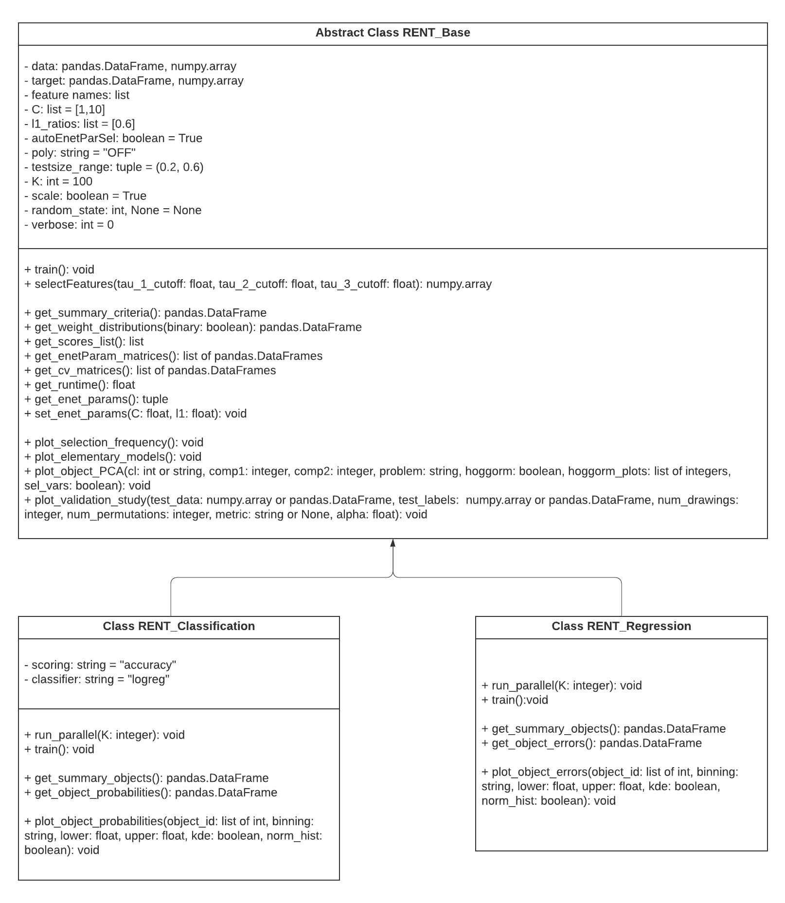

Quickstart
==========

RENT (Repeated Elastic Net Technique) is a package for feature selection for binary classification problems and regression problems. At its core
RENT trains an ensemble of unique models using regularized elastic net to select features. Each model in the ensemble is trained with
a unique and randomly selected subset from the full training data. From these models one can acquire weight distributions for each
feature that contain rich information on the stability of feature selection and from which several adjustable classification criteria may be
defined.

It is recommended to read the arXiv manuscript `RENT - Repeated Elastic Net Technique for Feature Selection`_, which provides a deeper explanation of the method and is helpful to improve the 
understanding of RENT and the available analysis methods. 

.. _RENT - Repeated Elastic Net Technique for Feature Selection: https://arxiv.org/abs/2009.12780v2

Requirements
------------
Make sure that Python 3.5 or higher is installed. A convenient way to install Python and many useful packages for scientific computing is to use the `Anaconda distribution`_.

.. _Anaconda distribution: https://www.anaconda.com/products/individual

    - numpy >= 1.11.3
    - pandas >= 1.0.5
    - scikit-learn >= 0.22
    - scipy >= 1.5.0
    - hoggorm >= 0.13.3
    - hoggormplot >= 0.13.2
    - matplotlib >= 3.2.2
    - seaborn >= 0.10

Documentation
-------------
The following Jupyter notebooks provides a `classification example <https://github.com/NMBU-Data-Science/RENT/blob/master/examples/Classification_example.ipynb>`_ and a `regression example <https://github.com/NMBU-Data-Science/RENT/blob/master/examples/Regression_example.ipynb>`_, illustrating the RENT workflow.

RENT repository on GitHub
----------------------------
The source code is available at the `RENT GitHub repository`_.

.. _RENT GitHub repository: https://github.com/NMBU-Data-Science/RENT

UML-Diagram
-----------
The UML-diagram provides an overview on the class-structure of the RENT implementation.

Testing
-------

The correctness of the results may checked using the test provided in the test folder.

After cloning the repository to your disk, at the command line navigate to the test folder. The code below shows an example of how to run the test for classification.

.. code-block:: bash
        
        pytest -v test_classification.py 

or for the regression

.. code-block:: bash
        
        pytest -v test_regression.py 

After testing is finished, pytest should report that none of tests failed. 

.. warning::
        You may get some warnings.

Classification Example
----------------------
The following python example illustrates RENT on the Wisconsin breast cancer (classification) dataset, available on scikit-learn.
First, we load and prepare the data. Then we initialize a RENT classification model, train it and select features. A

.. code-block:: python
   
    import pandas as pd
    from RENT import RENT

    # Load dataset 
    train_data = pd.read_csv("data/wisconsin_train.csv").iloc[:,1:]
    train_labels = pd.read_csv("data/wisconsin_train_labels.csv").iloc[:,1].values

    # Build RENT model
    # Define a range of regularisation parameters C for elastic net. A minimum of at least one value is required.
    my_C_params = [0.1, 1, 10]

    # Define a reange of l1-ratios for elastic net.  A minimum of at least one value is required.
    my_l1_ratios = [0, 0.1, 0.25, 0.5, 0.75, 0.9, 1]

    # Define setting for RENT
    model = RENT.RENT_Classification(data=train_data, 
                                        target=train_labels, 
                                        feat_names=train_data.columns, 
                                        C=my_C_params, 
                                        l1_ratios=my_l1_ratios,
                                        autoEnetParSel=True,
                                        poly='OFF',
                                        testsize_range=(0.25,0.25),
                                        scoring='mcc',
                                        classifier='logreg',
                                        K=100,
                                        random_state = 0,
                                        verbose=1)
    
    # After having initialized the RENT model, we train it. 
    model.train()

    # Actual feature selection step
    model.selectFeatures(tau_1_cutoff=0.9, tau_2_cutoff=0.9, tau_3_cutoff=0.975)

Regression Example
----------------------
The following python example illustrates RENT on a regression dataset, generated via the ``make_regression()`` function, offered in
scikit-learn.
First, we load and prepare the data. Then we initialize a RENT classification model, train it and select features.

.. code-block:: python
   
    import pandas as pd
    from RENT import RENT
    from sklearn.datasets import make_regression
    from sklearn.model_selection import train_test_split

    # Build dataset
    data = make_regression(n_samples=250, n_features=1000, n_informative=20, random_state=0, shuffle=False)
    my_data = pd.DataFrame(data[0])
    my_target = data[1]
    my_feat_names = ['f{0}'.format(x+1) for x in range(len(my_data.columns))]

    # We split the dataset into a separate train and (unseen) test dataset. 
    # Thus, we can evaluate a model build on the selected features, afterwards (see Jupyter notebook for regression).
    train_data, test_data, train_labels, test_labels = train_test_split(my_data, my_target, test_size=0.3, random_state=0)

    # Build RENT model
    # Define a range of regularisation parameters C for elastic net. A minimum of at least one value is required.
    my_C_params = [0.1, 1, 10]
    # Define a reange of l1-ratios for elastic net.  A minimum of at least one value is required.
    my_l1_ratios = [0, 0.1, 0.25, 0.5, 0.75, 0.9, 1]

    model = RENT.RENT_Regression(data=train_data, 
                                    target=train_labels, 
                                    feat_names=train_data.columns, 
                                    C= my_C_params, 
                                    l1_ratios=my_l1_ratios,
                                    autoEnetParSel=True,
                                    poly='OFF',
                                    testsize_range=(0.25,0.25),
                                    K=100,
                                    random_state=0,
                                    verbose=0)
                                    
    # After having initialized the RENT model, we train it. 
    model.train()

    # Actual feature selection step
    model.selectFeatures(tau_1_cutoff=0.9, tau_2_cutoff=0.9, tau_3_cutoff=0.975)
